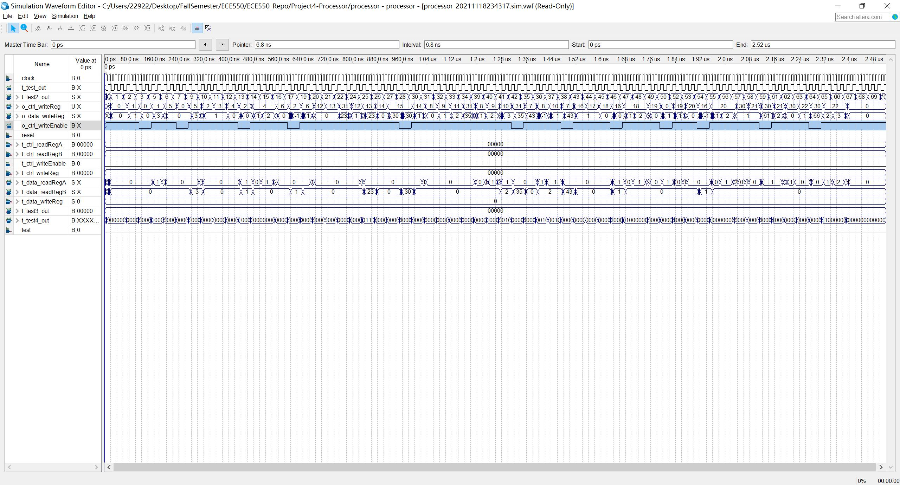

# ECE550_Processor
## Author: 
Mila Zhao(bz82) and Xianming Luo(xl369)
## Clock Assignment
We wrap the clock assignment into the clk_allocate.v. For processor, imem, and regfile, we use the same clock(25MHz), which is half the frequency of input clock. For dmem, we simply use the input clock, which is 50MHz.
The reason we assign clocks as this is because we need another rising edge for reading dmem, so that the frequency of dmem clock should be the double of other clocks.
## Source Structure
```
.
├── skeleton.v				#skeleton for processor
│	├── processor.v			#processor file
│	├── imem.v				#32-bit, 12-bit address instruction memory
│	├── dmem.v				#32-bit, 12-bit address data memory
│	└── regfile.v			#32-bit register file
└── ...
```
## Test Approach
We use waveform timing simulation to test. Our processor can work properly under 50MHz main clock.
And the waveform is as below.



